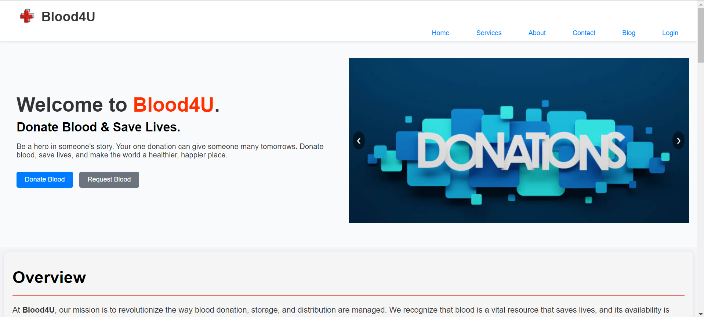
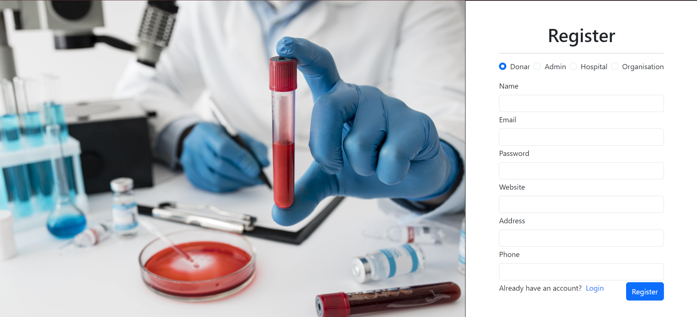
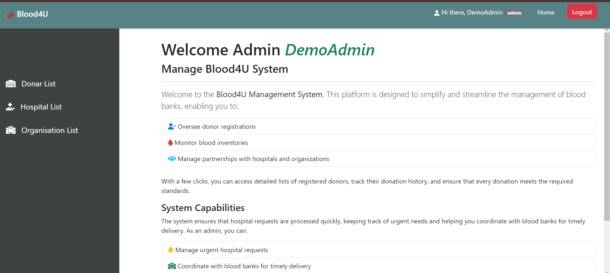

# Blood4U - Blood Donation Management System


## Table of Contents
1. [Description](#description)
2. [Features](#features)
3. [Installation](#installation)
4. [Usage](#usage)
5. [Screenshots](#screenshots)
6. [License](#license)


## Description
**Blood4U** is a comprehensive blood donation management system designed to streamline the process of blood donation and management. The system allows donors, recipients, and healthcare institutions to efficiently connect, manage blood banks, track donations, and provide real-time updates about blood availability.

The platform also provides educational content and resources about blood donation to raise awareness and encourage more donors to participate.

## Features
- **Donor Registration:** Easy signup and login for donors with blood group information.
- **Recipient Requests:** Recipients can create blood requests and track the status.
- **Blood Bank Management:** Hospitals and blood banks can manage their inventory and donors.
- **Notifications:** Automated notifications to donors and recipients about the status of requests and availability.
- **Search Functionality:** Search donors and blood banks based on location and blood type.
- **Real-time Availability:** Check real-time blood availability at registered blood banks.
- **Educational Resources:** Provides information about blood types, donation process, and health tips.
- **Admin Panel:** Admins can oversee the system, manage users, and update blood bank details.

## Installation
To get the Blood4U project running on your local machine, follow these steps:

1. **Clone the repository:**
   ```bash
   git clone https://github.com/ganesh9423/Blood-Bank-Management-App.git
  
## Usage

### Donor Registration
Users can sign up by providing their details, including:
- **Blood Type:** Select your blood type from a dropdown list.
- **Contact Information:** Enter your phone number and email address for communication.
- **Location:** Provide your address or city to help match with nearby recipients.
- **Additional Information:** Optionally include any medical history that may affect donation eligibility.

Once registered, donors can log in to their account to view their profile and donation history.

### Creating Blood Requests
Recipients can create a blood request by:
- **Specifying Required Blood Type:** Select the type of blood needed (e.g., A+, O-, etc.).
- **Location:** Provide the location where the blood is needed for delivery.
- **Urgency Level:** Indicate how urgently the blood is required (e.g., emergency, within 24 hours, etc.).
- **Contact Information:** Recipients should provide their contact details for communication.

After submitting a request, recipients will receive notifications about potential matches with donors.

### Search and Match
Users can utilize the search feature to find:
- **Donors:** Filter donors based on blood type and location.
- **Blood Banks:** Locate nearby blood banks, view their available blood types, and contact them directly.
- **Request Status:** Check the status of their blood requests and receive updates on matches.

### Admin Management
Admins have a dedicated panel to:
- **Manage Users:** View, edit, or deactivate user accounts (both donors and recipients).
- **Track Donations:** Monitor the history of donations and blood requests.
- **Update Blood Bank Inventory:** Maintain accurate records of blood available in various banks, ensuring real-time availability information.
- **Generate Reports:** Create reports for blood donation activities to analyze trends and improve the service.

## Screenshots
To provide a visual representation of the project, include screenshots of the application in action. Place the images in the `screenshots` folder and reference them in the README.


*Figure 1: Blood4U Homepage*


*Figure 2: Registration Form*


*Figure 3: Admin Home Page*

## License
This project is licensed under the MIT License. See the [LICENSE](LICENSE) file for details.

